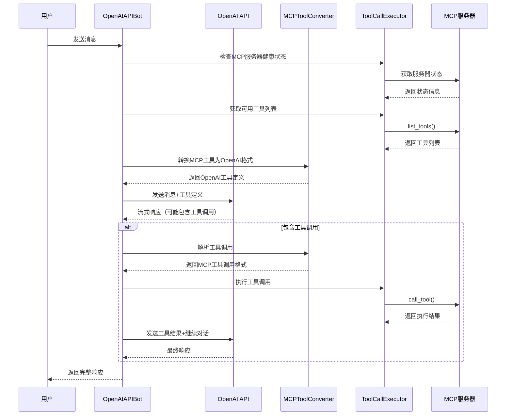

# BrainyAI API切换方案 - 技术实施文档

## 🎯 项目概述

**项目名称**：BrainyAI AI Chat API切换与MCP工具集成
**项目目标**：在现有Web版AI Chat基础上，增加OpenAI官方API支持，实现真正的MCP工具调用功能
**交付时间**：4-6周

---

## 🏗️ 技术架构设计

### 1. 双模式架构概览

```
用户选择模型 → ModelRouter → 选择Bot实现
├── Web模式：现有ChatGPT web版本（无工具调用）
│   ├── OpenaiBot (现有)
│   ├── CopilotBot (现有)
│   └── KimiBot (现有)
└── API模式：官方API（支持工具调用）
    ├── OpenAIAPIBot (新增)
    ├── ClaudeAPIBot (新增)
    └── GeminiAPIBot (新增)
```

### 2. 核心组件设计

#### A. ModelConfigManager (模型配置管理器)

```typescript
interface ModelConfig {
  id: string;
  name: string;
  provider: 'openai' | 'claude' | 'gemini' | 'custom';
  mode: 'web' | 'api';
  apiKey?: string;
  baseUrl?: string;
  model: string;
  supportsMCP: boolean;
  maxTokens: number;
  temperature: number;
}

class ModelConfigManager {
  private configs: Map<string, ModelConfig> = new Map();

  async addConfig(config: ModelConfig): Promise<void>
  async getConfig(id: string): Promise<ModelConfig | null>
  async listConfigs(): Promise<ModelConfig[]>
  async updateConfig(id: string, updates: Partial<ModelConfig>): Promise<void>
  async deleteConfig(id: string): Promise<void>
  async validateConfig(config: ModelConfig): Promise<boolean>
}
```

#### B. OpenAIAPIBot (OpenAI API Bot实现)

```typescript
import OpenAI from 'openai';
import { ChatCompletionTool, ChatCompletionMessageParam, ChatCompletionMessageToolCall } from 'openai/resources/chat/completions';
import { MCP, MCPTool } from '~libs/mcp';

export class OpenAIAPIBot extends BotBase implements IBot {
  static supportMCPTools = true;
  private openai: OpenAI;
  private modelConfig: ModelConfig;
  private toolConverter: MCPToolConverter;
  private toolExecutor: ToolCallExecutor;

  constructor(params: BotConstructorParams & { modelConfig: ModelConfig }) {
    super(params);
    this.modelConfig = params.modelConfig;
    this.openai = new OpenAI({
      apiKey: params.modelConfig.apiKey,
      baseURL: params.modelConfig.baseUrl,
      dangerouslyAllowBrowser: true
    });
    this.toolConverter = new MCPToolConverter();
    this.toolExecutor = new ToolCallExecutor();
  }

  async completion(params: BotCompletionParams): Promise<void> {
    try {
      // 检查MCP服务器健康状态
      if (params.enableMCPTools) {
        const healthCheck = await this.toolExecutor.checkServerHealth();
        if (!healthCheck.healthy) {
          console.warn('MCP servers have issues:', healthCheck.issues);
          // 可以选择继续执行但不启用工具，或者通知用户
        }
      }

      // 准备工具定义
      const tools = params.enableMCPTools ? await this.prepareMCPTools() : undefined;

      // 构建消息历史
      const messages = this.buildMessages(params.prompt);

      // 调用OpenAI API
      const response = await this.openai.chat.completions.create({
        model: this.modelConfig.model,
        messages: messages,
        tools: tools,
        tool_choice: tools && tools.length > 0 ? 'auto' : undefined,
        stream: true,
        temperature: this.modelConfig.temperature || 0.7,
        max_tokens: this.modelConfig.maxTokens || 4000
      });

      // 处理流式响应和工具调用
      await this.handleStreamResponse(response, params);

    } catch (error) {
      console.error('OpenAI API completion failed:', error);

      // 发送错误响应
      params.cb(params.rid, {
        message_type: ResponseMessageType.ERROR,
        message_text: `API调用失败: ${error.message}`,
        conversation_id: this.conversationId,
        message_id: Date.now().toString()
      });
    }
  }

  /**
   * 准备MCP工具定义
   */
  private async prepareMCPTools(): Promise<ChatCompletionTool[]> {
    try {
      const mcpTools = await this.toolExecutor.getAvailableTools();

      if (mcpTools.length === 0) {
        console.warn('No MCP tools available');
        return [];
      }

      const openaiTools = mcpTools.map(tool =>
        this.toolConverter.convertToOpenAIFunction(tool)
      );

      console.log(`Prepared ${openaiTools.length} MCP tools for OpenAI`);
      return openaiTools;

    } catch (error) {
      console.error('Failed to prepare MCP tools:', error);
      return [];
    }
  }

  /**
   * 处理流式响应和工具调用
   */
  private async handleStreamResponse(
    response: AsyncIterable<OpenAI.Chat.Completions.ChatCompletionChunk>,
    params: BotCompletionParams
  ): Promise<void> {
    let fullContent = '';
    let toolCalls: ChatCompletionMessageToolCall[] = [];
    let currentToolCall: Partial<ChatCompletionMessageToolCall> | null = null;

    try {
      // 处理流式响应
      for await (const chunk of response) {
        const delta = chunk.choices[0]?.delta;

        if (delta?.content) {
          fullContent += delta.content;

          // 发送增量内容
          params.cb(params.rid, {
            message_type: ResponseMessageType.GENERATING,
            message_text: delta.content,
            conversation_id: this.conversationId,
            message_id: chunk.id
          });
        }

        // 处理工具调用
        if (delta?.tool_calls) {
          for (const toolCallDelta of delta.tool_calls) {
            if (toolCallDelta.index !== undefined) {
              // 新的工具调用或切换到不同的工具调用
              if (currentToolCall && currentToolCall.index !== toolCallDelta.index) {
                // 完成当前工具调用
                if (this.isToolCallComplete(currentToolCall)) {
                  toolCalls.push(currentToolCall as ChatCompletionMessageToolCall);
                }
                currentToolCall = null;
              }

              if (!currentToolCall) {
                currentToolCall = {
                  index: toolCallDelta.index,
                  id: toolCallDelta.id || '',
                  type: 'function',
                  function: {
                    name: toolCallDelta.function?.name || '',
                    arguments: toolCallDelta.function?.arguments || ''
                  }
                };
              } else {
                // 累积工具调用数据
                if (toolCallDelta.function?.arguments) {
                  currentToolCall.function!.arguments += toolCallDelta.function.arguments;
                }
              }
            }
          }
        }
      }

      // 完成最后一个工具调用
      if (currentToolCall && this.isToolCallComplete(currentToolCall)) {
        toolCalls.push(currentToolCall as ChatCompletionMessageToolCall);
      }

      // 如果有工具调用，执行它们
      if (toolCalls.length > 0) {
        await this.executeToolCalls(toolCalls, params, fullContent);
      } else {
        // 没有工具调用，发送完成响应
        params.cb(params.rid, {
          message_type: ResponseMessageType.DONE,
          message_text: fullContent,
          conversation_id: this.conversationId,
          message_id: Date.now().toString()
        });
      }

    } catch (error) {
      console.error('Error handling stream response:', error);
      params.cb(params.rid, {
        message_type: ResponseMessageType.ERROR,
        message_text: `处理响应时出错: ${error.message}`,
        conversation_id: this.conversationId,
        message_id: Date.now().toString()
      });
    }
  }

  /**
   * 执行工具调用
   */
  private async executeToolCalls(
    toolCalls: ChatCompletionMessageToolCall[],
    params: BotCompletionParams,
    assistantMessage: string
  ): Promise<void> {
    try {
      // 通知用户正在执行工具调用
      params.cb(params.rid, {
        message_type: ResponseMessageType.GENERATING,
        message_text: `\n\n🔧 正在执行 ${toolCalls.length} 个工具调用...`,
        conversation_id: this.conversationId,
        message_id: Date.now().toString()
      });

      // 转换工具调用格式
      const mcpToolCalls = await this.toolConverter.convertToolCalls(toolCalls);

      // 执行工具调用
      const toolResults = await this.toolExecutor.executeToolCalls(mcpToolCalls);

      // 格式化工具结果
      const toolMessages = this.toolExecutor.formatToolResults(toolResults);

      // 构建包含工具调用结果的消息
      const messages: ChatCompletionMessageParam[] = [
        ...this.buildMessages(params.prompt),
        {
          role: 'assistant',
          content: assistantMessage,
          tool_calls: toolCalls
        },
        ...toolMessages
      ];

      // 再次调用OpenAI API获取最终响应
      const finalResponse = await this.openai.chat.completions.create({
        model: this.modelConfig.model,
        messages: messages,
        stream: true,
        temperature: this.modelConfig.temperature || 0.7
      });

      let finalContent = '';
      for await (const chunk of finalResponse) {
        const delta = chunk.choices[0]?.delta;
        if (delta?.content) {
          finalContent += delta.content;
          params.cb(params.rid, {
            message_type: ResponseMessageType.GENERATING,
            message_text: delta.content,
            conversation_id: this.conversationId,
            message_id: chunk.id
          });
        }
      }

      // 发送完成响应
      params.cb(params.rid, {
        message_type: ResponseMessageType.DONE,
        message_text: finalContent,
        conversation_id: this.conversationId,
        message_id: Date.now().toString()
      });

    } catch (error) {
      console.error('Tool execution failed:', error);
      params.cb(params.rid, {
        message_type: ResponseMessageType.ERROR,
        message_text: `工具执行失败: ${error.message}`,
        conversation_id: this.conversationId,
        message_id: Date.now().toString()
      });
    }
  }

  /**
   * 检查工具调用是否完整
   */
  private isToolCallComplete(toolCall: Partial<ChatCompletionMessageToolCall>): boolean {
    return !!(toolCall.id && toolCall.function?.name && toolCall.function?.arguments);
  }

  /**
   * 构建消息历史
   */
  private buildMessages(prompt: string): ChatCompletionMessageParam[] {
    // 这里应该根据实际的对话历史构建消息数组
    // 简化实现，实际应该包含完整的对话历史
    return [
      {
        role: 'system',
        content: 'You are a helpful assistant with access to various tools. Use tools when appropriate to help the user.'
      },
      {
        role: 'user',
        content: prompt
      }
    ];
  }

  getBotName(): string {
    return `OpenAI-API-${this.modelConfig.model}`;
  }
}
```

#### C. ModelRouter (模型路由器)

```typescript
class ModelRouter {
  private configManager: ModelConfigManager;
  private botInstances: Map<string, IBot> = new Map();

  async getBot(modelId: string, conversationId: string): Promise<IBot> {
    const config = await this.configManager.getConfig(modelId);
    if (!config) throw new Error(`Model config not found: ${modelId}`);

    const botKey = `${modelId}-${conversationId}`;

    if (!this.botInstances.has(botKey)) {
      const bot = this.createBot(config, conversationId);
      this.botInstances.set(botKey, bot);
    }

    return this.botInstances.get(botKey)!;
  }

  private createBot(config: ModelConfig, conversationId: string): IBot {
    const params = { globalConversationId: conversationId, modelConfig: config };

    switch (config.provider) {
      case 'openai':
        return config.mode === 'api'
          ? new OpenAIAPIBot(params)
          : new OpenaiBot({ globalConversationId: conversationId });
      case 'claude':
        return config.mode === 'api'
          ? new ClaudeAPIBot(params)
          : new ClaudeBot({ globalConversationId: conversationId });
      default:
        throw new Error(`Unsupported provider: ${config.provider}`);
    }
  }
}
```

---

## 📱 用户界面实现

### 1. 模型配置界面扩展

#### A. 扩展现有Add Model Configuration

```typescript
// 在现有配置界面基础上增加字段
interface ModelConfigFormData {
  // 现有字段
  name: string;
  apiType: string;
  apiKey: string;
  model: string;
  baseUrl: string;

  // 新增字段
  mode: 'web' | 'api';
  supportsMCP: boolean;
  mcpToolsEnabled: boolean;
  toolConfirmation: boolean;
}

// 界面组件更新
const ModelConfigForm: React.FC = () => {
  return (
    <form>
      {/* 现有字段 */}

      {/* 新增：模式选择 */}
      <div className="form-group">
        <label>模式</label>
        <select name="mode">
          <option value="web">Web版本 (免费，基础功能)</option>
          <option value="api">API版本 (付费，支持工具调用)</option>
        </select>
      </div>

      {/* 新增：MCP工具支持 */}
      {formData.mode === 'api' && (
        <div className="form-group">
          <label>
            <input type="checkbox" name="supportsMCP" />
            启用MCP工具支持
          </label>
          <small>允许AI调用外部工具完成复杂任务</small>
        </div>
      )}
    </form>
  );
};
```

#### B. AI Models选择界面更新

```typescript
const ModelCard: React.FC<{ model: ModelConfig }> = ({ model }) => {
  return (
    <div className={`model-card ${model.supportsMCP ? 'mcp-enabled' : ''}`}>
      <div className="model-header">
        <span className="model-name">{model.name}</span>
        {model.supportsMCP && (
          <span className="mcp-badge">🔧 支持工具</span>
        )}
        {model.mode === 'api' && (
          <span className="api-badge">API</span>
        )}
      </div>

      <div className="model-info">
        <span className="token-limit">{model.maxTokens / 1000}k</span>
        {model.mode === 'api' && (
          <span className="cost-info">💰 按使用计费</span>
        )}
      </div>
    </div>
  );
};
```

### 2. 聊天界面增强

#### A. 工具状态显示

```typescript
const ChatHeader: React.FC<{ currentModel: ModelConfig }> = ({ currentModel }) => {
  return (
    <div className="chat-header">
      <div className="model-info">
        <span className="model-name">{currentModel.name}</span>
        {currentModel.supportsMCP && (
          <div className="mcp-status">
            <span className="mcp-indicator">🔧 MCP工具已启用</span>
            <button className="mcp-settings">设置</button>
          </div>
        )}
      </div>
    </div>
  );
};
```

#### B. 工具调用过程显示

```typescript
const ToolCallIndicator: React.FC<{ toolCall: ToolCall }> = ({ toolCall }) => {
  return (
    <div className="tool-call-indicator">
      <div className="tool-call-header">
        <span className="tool-icon">🔧</span>
        <span className="tool-name">正在调用 {toolCall.function.name}</span>
        <span className="tool-status">{toolCall.status}</span>
      </div>

      {toolCall.status === 'executing' && (
        <div className="tool-progress">
          <div className="progress-bar"></div>
          <span className="progress-text">执行中...</span>
        </div>
      )}

      {toolCall.result && (
        <div className="tool-result">
          <pre>{JSON.stringify(toolCall.result, null, 2)}</pre>
        </div>
      )}
    </div>
  );
};
```

---

## 🔧 MCP工具集成实现

### 重要说明：MCP传输协议支持

根据MCP规范，当前BrainyAI支持以下传输协议：

#### 1. **stdio传输** (推荐用于本地工具)
- MCP服务器作为子进程运行
- 通过stdin/stdout进行JSON-RPC通信
- 适用于本地工具如文件系统、天气查询等
- 现有MCPProcessManager已支持此协议

#### 2. **Streamable HTTP传输** (适用于远程服务)
- MCP服务器作为独立HTTP服务运行
- 支持POST请求发送消息，GET请求接收SSE流
- 支持会话管理和连接恢复
- 需要扩展现有MCPClient以支持此协议

#### 3. **安全考虑**
- 本地服务器应绑定到localhost (127.0.0.1)
- HTTP服务器必须验证Origin头防止DNS重绑定攻击
- 实施适当的认证机制

```typescript
// MCP传输协议配置示例
interface MCPTransportConfig {
  type: 'stdio' | 'http' | 'streamable-http';

  // stdio配置
  command?: string;
  args?: string[];
  cwd?: string;
  env?: Record<string, string>;

  // HTTP配置
  url?: string;
  headers?: Record<string, string>;
  timeout?: number;

  // 安全配置
  allowedOrigins?: string[];
  authentication?: {
    type: 'bearer' | 'basic' | 'custom';
    credentials: string;
  };
}
```

### 1. MCP工具转换为OpenAI Function格式

```typescript
import { MCPTool, MCPToolCall, MCP } from '~libs/mcp';

class MCPToolConverter {
  /**
   * 将MCP工具转换为OpenAI Function格式
   */
  static convertToOpenAIFunction(mcpTool: MCPTool): ChatCompletionTool {
    // 处理MCP工具的inputSchema，可能是JSON Schema格式
    const parameters = this.normalizeSchema(mcpTool.inputSchema);

    return {
      type: 'function',
      function: {
        name: mcpTool.name,
        description: mcpTool.description || `Execute ${mcpTool.name} tool`,
        parameters: parameters
      }
    };
  }

  /**
   * 规范化MCP工具的schema为OpenAI Function参数格式
   */
  private static normalizeSchema(inputSchema: any): any {
    if (!inputSchema) {
      return {
        type: 'object',
        properties: {},
        required: []
      };
    }

    // 如果已经是标准JSON Schema格式
    if (inputSchema.type === 'object' && inputSchema.properties) {
      return {
        type: 'object',
        properties: inputSchema.properties,
        required: inputSchema.required || []
      };
    }

    // 如果是简化格式，转换为标准格式
    if (typeof inputSchema === 'object' && !inputSchema.type) {
      return {
        type: 'object',
        properties: inputSchema,
        required: []
      };
    }

    // 默认返回空对象schema
    return {
      type: 'object',
      properties: {},
      required: []
    };
  }

  /**
   * 将OpenAI工具调用转换为MCP工具调用格式
   */
  static async convertToolCalls(
    toolCalls: ChatCompletionMessageToolCall[]
  ): Promise<MCPToolCallRequest[]> {
    const mcpToolCalls: MCPToolCallRequest[] = [];

    for (const call of toolCalls) {
      try {
        const args = JSON.parse(call.function.arguments);

        // 查找工具所属的服务器
        const serverName = await this.findToolServer(call.function.name);

        mcpToolCalls.push({
          id: call.id,
          toolName: call.function.name,
          serverName: serverName,
          args: args
        });
      } catch (error) {
        console.error(`Failed to parse tool call arguments for ${call.function.name}:`, error);
        // 添加错误的工具调用，后续处理时会返回错误
        mcpToolCalls.push({
          id: call.id,
          toolName: call.function.name,
          serverName: 'unknown',
          args: {},
          error: `Invalid arguments: ${error.message}`
        });
      }
    }

    return mcpToolCalls;
  }

  /**
   * 查找工具所属的服务器
   */
  private static async findToolServer(toolName: string): Promise<string> {
    try {
      const allTools = await MCP.getAllTools();
      const tool = allTools.find(t => t.name === toolName);
      return tool?.serverName || 'default';
    } catch (error) {
      console.error(`Failed to find server for tool ${toolName}:`, error);
      return 'default';
    }
  }
}

interface MCPToolCallRequest {
  id: string;
  toolName: string;
  serverName: string;
  args: any;
  error?: string;
}
```

### 2. 工具调用执行器

```typescript
import { MCP, MCPToolResult, MCPError } from '~libs/mcp';

class ToolCallExecutor {
  private mcpManager: typeof MCP;

  constructor() {
    this.mcpManager = MCP;
  }

  /**
   * 执行MCP工具调用
   */
  async executeToolCalls(toolCalls: MCPToolCallRequest[]): Promise<ToolCallResult[]> {
    const results: ToolCallResult[] = [];

    // 并发执行工具调用（但要控制并发数）
    const concurrentLimit = 3;
    const chunks = this.chunkArray(toolCalls, concurrentLimit);

    for (const chunk of chunks) {
      const chunkResults = await Promise.allSettled(
        chunk.map(call => this.executeSingleTool(call))
      );

      chunkResults.forEach((result, index) => {
        const call = chunk[index];
        if (result.status === 'fulfilled') {
          results.push(result.value);
        } else {
          results.push({
            id: call.id,
            success: false,
            error: result.reason?.message || 'Unknown error',
            duration: 0
          });
        }
      });
    }

    return results;
  }

  /**
   * 执行单个工具调用
   */
  private async executeSingleTool(call: MCPToolCallRequest): Promise<ToolCallResult> {
    const startTime = Date.now();

    try {
      // 如果工具调用本身有错误，直接返回错误
      if (call.error) {
        return {
          id: call.id,
          success: false,
          error: call.error,
          duration: 0
        };
      }

      // 检查服务器状态
      const serverStatus = this.mcpManager.getServerStatus(call.serverName);
      if (serverStatus.status !== 'running') {
        throw new MCPError(
          `Server ${call.serverName} is not running (status: ${serverStatus.status})`,
          'SERVER_NOT_RUNNING',
          call.serverName
        );
      }

      // 调用MCP工具
      const result = await this.mcpManager.callTool(
        call.serverName,
        call.toolName,
        call.args
      );

      return {
        id: call.id,
        success: true,
        result: result,
        duration: Date.now() - startTime
      };

    } catch (error) {
      console.error(`Tool call failed for ${call.toolName}:`, error);

      return {
        id: call.id,
        success: false,
        error: error instanceof MCPError
          ? `${error.code}: ${error.message}`
          : error.message || 'Unknown error',
        duration: Date.now() - startTime
      };
    }
  }

  /**
   * 格式化工具调用结果为OpenAI消息格式
   */
  formatToolResults(results: ToolCallResult[]): ChatCompletionMessageParam[] {
    return results.map(result => ({
      role: 'tool' as const,
      tool_call_id: result.id,
      content: result.success
        ? this.formatSuccessResult(result.result)
        : this.formatErrorResult(result.error, result.duration)
    }));
  }

  /**
   * 格式化成功结果
   */
  private formatSuccessResult(result: any): string {
    if (typeof result === 'string') {
      return result;
    }

    if (typeof result === 'object' && result !== null) {
      // 如果结果有特定的文本字段，优先使用
      if (result.text || result.content || result.message) {
        return result.text || result.content || result.message;
      }

      // 否则返回JSON格式
      return JSON.stringify(result, null, 2);
    }

    return String(result);
  }

  /**
   * 格式化错误结果
   */
  private formatErrorResult(error: string, duration?: number): string {
    const durationText = duration ? ` (${duration}ms)` : '';
    return `Tool execution failed${durationText}: ${error}`;
  }

  /**
   * 将数组分块
   */
  private chunkArray<T>(array: T[], size: number): T[][] {
    const chunks: T[][] = [];
    for (let i = 0; i < array.length; i += size) {
      chunks.push(array.slice(i, i + size));
    }
    return chunks;
  }

  /**
   * 获取可用工具列表
   */
  async getAvailableTools(): Promise<MCPTool[]> {
    try {
      return await this.mcpManager.getAllTools();
    } catch (error) {
      console.error('Failed to get available tools:', error);
      return [];
    }
  }

  /**
   * 检查MCP服务器状态
   */
  async checkServerHealth(): Promise<{ healthy: boolean; issues: string[] }> {
    const issues: string[] = [];

    try {
      const tools = await this.getAvailableTools();
      const serverNames = [...new Set(tools.map(t => t.serverName).filter(Boolean))];

      for (const serverName of serverNames) {
        const status = this.mcpManager.getServerStatus(serverName);
        if (status.status !== 'running') {
          issues.push(`Server ${serverName} is ${status.status}`);
        }
      }

      return {
        healthy: issues.length === 0,
        issues
      };
    } catch (error) {
      issues.push(`Failed to check server health: ${error.message}`);
      return {
        healthy: false,
        issues
      };
    }
  }
}

interface ToolCallResult {
  id: string;
  success: boolean;
  result?: any;
  error?: string;
  duration?: number;
}
```

---

## 📦 实施计划

### Phase 1: 基础架构搭建 (1-2周)

#### 任务1.1: ModelConfigManager开发

- [ ] 创建ModelConfig接口定义
- [ ] 实现ModelConfigManager类
- [ ] 添加配置的持久化存储
- [ ] 实现配置验证逻辑

#### 任务1.2: OpenAIAPIBot基础实现

- [ ] 创建OpenAIAPIBot类
- [ ] 集成OpenAI SDK
- [ ] 实现基础聊天功能
- [ ] 添加流式响应处理

#### 任务1.3: ModelRouter实现

- [ ] 创建ModelRouter类
- [ ] 实现Bot实例管理
- [ ] 添加模型路由逻辑

### Phase 2: MCP工具集成 (2-3周)

#### 任务2.1: 工具转换器开发

- [ ] 实现MCPToolConverter
- [ ] 添加工具格式转换逻辑（支持多种schema格式）
- [ ] 实现工具调用解析和服务器映射
- [ ] 添加schema验证和错误处理

#### 任务2.2: 工具执行器开发

- [ ] 实现ToolCallExecutor
- [ ] 添加并发控制和批量执行逻辑
- [ ] 实现服务器健康检查
- [ ] 添加结果格式化和错误处理
- [ ] 实现执行时间统计和性能监控

#### 任务2.3: OpenAIAPIBot工具集成

- [ ] 集成完整的工具调用流程
- [ ] 实现流式响应中的工具调用处理
- [ ] 添加工具调用状态通知
- [ ] 实现多轮对话中的工具调用
- [ ] 添加工具调用确认机制（可选）
- [ ] 完善错误处理和降级策略

#### 任务2.4: MCP传输协议扩展

- [ ] 扩展MCPClient支持Streamable HTTP传输
- [ ] 实现HTTP MCP服务器连接管理
- [ ] 添加会话管理和连接恢复
- [ ] 实现安全认证和Origin验证

### MCP工具调用完整流程



### Phase 3: 界面完善 (1周)

#### 任务3.1: 配置界面更新

- [ ] 扩展Add Model Configuration界面
- [ ] 添加MCP工具配置选项
- [ ] 实现配置验证和测试

#### 任务3.2: 聊天界面增强

- [ ] 添加工具状态显示
- [ ] 实现工具调用过程展示
- [ ] 添加工具调用历史

#### 任务3.3: AI Models界面更新

- [ ] 更新模型卡片显示
- [ ] 添加工具支持标识
- [ ] 实现模型筛选功能

---

## 🔒 安全性考虑

### 1. API Key安全

```typescript
class SecureStorage {
  private static encrypt(data: string): string {
    // 使用浏览器内置加密API
    return btoa(data); // 简化示例，实际应使用更强的加密
  }

  private static decrypt(encryptedData: string): string {
    return atob(encryptedData);
  }

  static async storeApiKey(modelId: string, apiKey: string): Promise<void> {
    const encrypted = this.encrypt(apiKey);
    await chrome.storage.local.set({ [`apikey_${modelId}`]: encrypted });
  }

  static async getApiKey(modelId: string): Promise<string | null> {
    const result = await chrome.storage.local.get([`apikey_${modelId}`]);
    const encrypted = result[`apikey_${modelId}`];
    return encrypted ? this.decrypt(encrypted) : null;
  }
}
```

### 2. 权限控制

```typescript
interface MCPPermissions {
  allowedTools: string[];
  requireConfirmation: boolean;
  maxConcurrentCalls: number;
  timeoutMs: number;
}

class PermissionManager {
  async checkToolPermission(toolName: string): Promise<boolean>
  async requestUserConfirmation(toolCall: MCPToolCall): Promise<boolean>
  async enforceRateLimit(userId: string): Promise<boolean>
}
```

---

## 📊 测试策略

### 1. 单元测试

```typescript
// ModelConfigManager测试
describe('ModelConfigManager', () => {
  test('should add and retrieve model config', async () => {
    const manager = new ModelConfigManager();
    const config: ModelConfig = {
      id: 'test-model',
      name: 'Test Model',
      provider: 'openai',
      mode: 'api',
      model: 'gpt-4',
      supportsMCP: true,
      maxTokens: 4000,
      temperature: 0.7
    };

    await manager.addConfig(config);
    const retrieved = await manager.getConfig('test-model');
    expect(retrieved).toEqual(config);
  });
});
```

### 2. 集成测试

```typescript
// OpenAIAPIBot集成测试
describe('OpenAIAPIBot Integration', () => {
  test('should handle MCP tool calls', async () => {
    const bot = new OpenAIAPIBot({
      globalConversationId: 'test',
      modelConfig: testConfig
    });

    const mockCallback = jest.fn();
    await bot.completion({
      prompt: '今天北京天气怎么样？',
      rid: 'test-rid',
      cb: mockCallback,
      enableMCPTools: true
    });

    expect(mockCallback).toHaveBeenCalledWith(
      'test-rid',
      expect.objectContaining({
        message_type: ResponseMessageType.DONE,
        message_text: expect.stringContaining('天气')
      })
    );
  });
});
```

---

## 🚀 部署和发布

### 1. 构建配置

```json
// package.json 更新
{
  "dependencies": {
    "openai": "^4.0.0",
    "@anthropic-ai/sdk": "^0.20.0",
    "@google/generative-ai": "^0.1.0"
  }
}
```

### 2. 环境配置

```typescript
// .env.example 更新
OPENAI_API_KEY=your_openai_api_key_here
CLAUDE_API_KEY=your_claude_api_key_here
GEMINI_API_KEY=your_gemini_api_key_here
```

### 3. 发布检查清单

- [ ] 所有单元测试通过
- [ ] 集成测试通过
- [ ] 安全性审查完成
- [ ] 用户界面测试完成
- [ ] 性能测试通过
- [ ] 文档更新完成

---

## 📞 技术支持

### 开发团队联系方式

- **产品经理**：负责需求澄清和优先级确认
- **前端开发**：负责界面实现和用户体验
- **后端开发**：负责API集成和工具调用
- **测试工程师**：负责质量保证和测试执行

### 关键决策点

1. **API Key存储方式**：本地加密 vs 服务端托管
2. **工具调用确认机制**：自动执行 vs 用户确认
3. **错误处理策略**：降级到Web模式 vs 显示错误
4. **成本控制**：用户自付费 vs 平台补贴

---

**文档版本**：v1.0
**最后更新**：2025-06-15
**状态**：待开发团队实施
